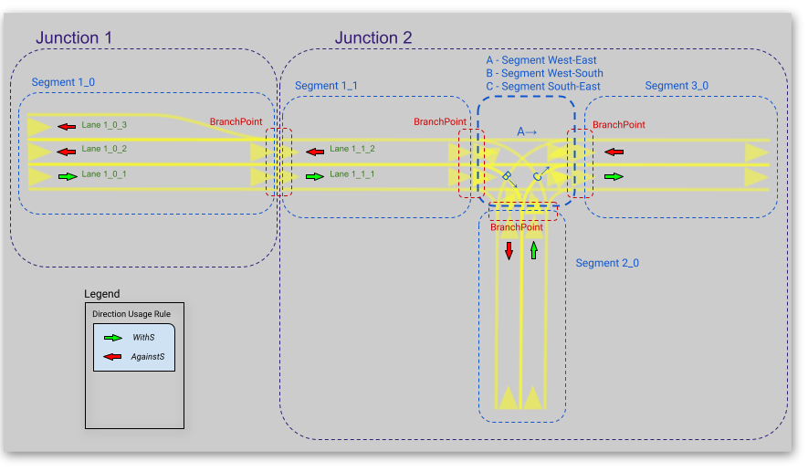

**********************************
Maliput Overview
**********************************

.. contents:: Table of Contents
    :depth: 5

Summary
=======

A C++ runtime API describing a Road Network model for use in agent and traffic simulations.
It guarantees a continuous description of the road geometry and supports dynamic environments
with varying rules states.
There are currently several implementations of maliput, the most complex one is based on `OpenDRIVE` specification.

Features
--------

* G1 Contiguous road geometry description with tolerance control.
* Lane-FRAME and Inertial-FRAME support.
* Customizable traffic rules.
* Handles dynamic rule environments.
* Supports Traffic Lights.
* Convenience functions to query the Road Network and its Rules.
* Available maliput backend based on `OpenDRIVE` specification.
* Plugin architecture to extend Road Network implementation.
* C++ 17 compatible API.
* Python bindings.
* Support for ROS2 Foxy.
* BSD 3-Clause License.

Maliput components
==================

Road Network
------------

maliput is a runtime API that describes the road volume and connectivity graph.
The road model is accessed via an abstract C++ API.

`maliput` is agnostic of the data source for a road network. Concrete implementations for different data sources will expose the same abstract interface.
Some networks may be completely synthetic (i.e. they are built from the road surface mathematical function), others will be created from measurements of real-life roads (i.e. sampled surfaces).

Road Geometry model
-------------------

In the lexicon of `maliput` and its C++ API, the road volume manifold is called a `RoadGeometry`. A `RoadGeometry` is partitioned into `Segments`, which correspond to stretches of asphalt (and the space above and/or below them).
Each `Segment` is a group of one or more adjacent `Lanes`. A `Lane` corresponds to a lane of travel on a road, and defines a specific parameterization of the parent `Segment`'s volume from a local Lane-Frame into the Inertial-frame.
`Lanes` are connected at `BranchPoints`, and the graph of `Lanes` and `BranchPoints` describes the topology of a `RoadGeometry`. `Segments` which map to intersecting volumes of the Inertial-frame (e.g., road intersections) are grouped together into `Junctions`.
The semantic direction of the lane isn't defined by the geometry but by traffic rules. Almost all lane properties will be defined by rules because of their convenient state dynamics.

To summarize, there are two complementary object graphs in `maliput`. The container hierarchy (`Junctions` contain `Segments`, which contain `Lanes`) groups together different parts of the entire road surface.
Solving the routing graph (`Lanes` are joined end-to-end via `BranchPoints`) allows to derive routes in the road network.

A `RoadGeometry` may also model laterally adjacent paths to the road, such as sidewalks. If there is no G1 continuity between the road and its adjacent paths, the two must be separated by `Segment` boundaries.
It does not violate `maliput`'s continuity constraint because `maliput` has no notion of laterally-adjacent `Segments`.

Frames
^^^^^^

* The **Inertial-Frame** is any right-handed 3D inertial Cartesian coordinate system, with orthonormal basis (x̂, ŷ, ẑ) and positions expressed as triples (x,y,z).
* The **Lane-frame** is a right-handed orthonormal curvilinear coordinate system, with positions expressed as coordinates (s,r,h). Each Lane in a ``RoadGeometry`` defines its own embedding into the Inertial space, and thus each Lane has its own Lane-Frame.

G1 Contiguity
^^^^^^^^^^^^^

G1 contiguity is controlled via a linear tolerance (measured in meters) and an angular tolerance (measured in radians). Tolerances are checked at the BranchPoints by `maliput` API and it is required that the implementation respects them for all points the `RoadGeometry` volume.

Road Network Example
--------------------

TODO: Mention about queries provided to traverse the graph.

Intersections
-------------

`maliput` provides a register of `Intersections` called `IntersectionBook` which holds all the `Intersections` in the map.
Each `Intersection` aggregates related entities by zone and applied rules and their states.

Traffic Rules
-------------

Rules
^^^^^

In `maliput` the rules have the following properties:

* `zone`: the lane route where the rule applies.
* `type`: user defined rule types: speed-limit rule, right-of-way rule, direction usage rule, vehicle usage rule, etc.
* `states`: Each rule could be static (ie. it has one state) or dynamic (it has multiple states). The API supports having states that are either a discrete valued (which are named by string labels) or define a contiguous range of a quantity (a.k.a. `DiscreteValueRule` and `RangeValueRule`). Each state has the following properties:

  * `severity`: A non-negative quantity that specifies the level of enforcement.
  * `related rules`: Holds groups of rules that are related to the one being described.
  * `related unique ids`: Holds groups of related uniques ids typically used for traffic lights' bulb groups.

The Rules API allows adding as rules and rule types as needed.

RoadRulebook
^^^^^^^^^^^^

A `RoadRulebook` contains the semantic traffic rules for a road network, as rule elements associated to components of a `RoadGeometry`.
The `RoadRulebook` API provides methods to obtain the rules that apply to a certain lane range.

Filling the book
""""""""""""""""

The `RoadRulebook` can be filled with rules by two different ways:
 * Manually by using the `ManualRoadRulebook` API.
 * Automatically by loading a YAML file where all the rules were previously described.

RuleRegistry
^^^^^^^^^^^^

The `RuleRegistry` works as a register of rule types in which the `RoadRulebook` relies on when the rules are being created.
In consequence, the final rules are coherent with the kind of rules that are available for a RoadNetwork in particular. For example:
Different cities may have different number of rules and all diversity of rule types.

The `RuleRegistry` can be filled with rules by two different ways:
 * Manually by using the `RuleRegistry` API.
 * Automatically by loading a YAML file where all the rule types were previously described.

Traffic Lights
--------------

`maliput` has support for Traffic Lights. For each traffic light
a position and orientation is defined in the Inertial-frame.
Each traffic light could be composed by one or more bulb groups, where each bulb group is refered to the 
frame of traffic light that contains it.
Furthermore, the bulbs of each bulb group defines a color and the state, among other things.

In consequence, it is possible to define pretty complex traffic lights arrays, where bulbs' states changes as required.

Dynamic Rules
-------------

`maliput` supports dynamic states of rules. Having more than one possible state per rule could make systems pretty complex
when handling the environment.
To help the user to handle this situations, `maliput` also provides convenience methods and entities for such a goal.

Phases
^^^^^^

In a typical intersection we could localize at least two types of actors being present, whose states may change on time basis.
 - Traffic Lights: To organize the traffic by managing the right of way in the intersection, the traffic lights change their state.
 - Right-Of-Way Rules: This rule isn't static, given that its state will depend on the state of the traffic lights.

`maliput` introduces the concept of `Phase` which in essence is a group of rules and their states that apply to an intersection.
In the intersection just proposed, it is expected to have many `phases`. To handle this situation a `PhaseRing` class is provided to
manage the Phases per intersection and also to iterate them.

TODO: Here there should be a link to more information about phases. Probably to an example as it is the best way to understand phases, phase ring and phase providers.

Maliput Design and Architecture
===============================

`maliput` package is in essence a C++ runtime API with most of the classes being purely virtual.

Along the API, other namespaces/libraries are provided by `maliput`:

* **api**: Defines the `maliput` API.
* **base**: Base implementations of rules and traffic-lights related API.
* **geometry_base**: Base implementations of geometry-related API.
* **common**: Contains classes used by other namespaces and packages.(i.g: Logger, errors, etc)
* **math**: Math library providing support for vector, matrix, quaternion, and roll, pitch and yaw representations.
* **plugin**: Maliput provides a plugin architecture for easily customize certain systems implementations.
* **routing**: Provides methods to obtain routes in the `RoadNetwork` graph.
* **test_utilities**: Contains convenience helpers for testing the `RoadNetwork`.
* **utilities**: Provides useful methods and classes related to mesh generation and concurrent task solvers.
* **utility**: Contains file-handling related methods.

Implementing Maliput backend
----------------------------

As we mentioned before `maliput` defines an API that forces the backends to meet its requirements.

When implementing a maliput backend, the following needs to be taken into account.

1 - Implement classes related to the road geometry model:

* `maliput::api::RoadGeometry`: It is partially implemented at `maliput::base`, however the fundamental geometric methods that define the immersion of `lane`-frame into `Inertial`-frame is the job of each specific backend.
* `maliput::api::Lane`: A Lane represents a lane of travel in a road network. It is necessary to define a road model for the lanes.

2 - Populate the `RoadNetwork`:

* Add `Lanes` to `Segments`.
* Add `Segments` `Junctions`.
* Add `Junctions` to the `RoadGeometry`.
* Populate RoadNetwork related entities: Many of them have a builder at maliput::base to easily create them.

  * RuleRegistry
  * RoadRulebook.
  * IntersectionBook.
  * TrafficLightBook.
  * PhaseRingBook.
  * PhaseProvider
  * DiscreteValueRuleStateProvider
  * RangeValueRuleStateProvider

Maliput Plugin Architecture
^^^^^^^^^^^^^^^^^^^^^^^^^^^

`maliput` provides an architecture that allows users to customize certain systems implementations in an easy and effective way.
Maliput clients may opt to use the plugin architecture to load at runtime specific backends.
That simplifies the linkage process and reduces the number of compile time dependencies.

For further information refer to `Maliput Plugin Architecture <from_doxygen/html/deps/maliput/html/maliput_plugin_architecture.html>`_ page.

Maliput backends
================

Available concrete implementations of the abstract API:

* `maliput_dragway <https://github.com/ToyotaResearchInstitute/maliput_dragway>`_ : `maliput_dragway is an implementation of `maliput`'s API that allows users to instantiate a multilane dragway. All lanes in the dragway are straight, parallel, and in the same segment. The ends of each lane are connected together via a "magical loop" that results in vehicles traveling on the Dragway's lanes instantaneously teleporting from one end of the lane to the opposite end of the lane. The number of lanes and their lengths, widths, and shoulder widths are all user specifiable.

* `maliput_multilane <https://github.com/ToyotaResearchInstitute/maliput_multilane>`_: `maliput_multilane` is an implementation of `maliput`'s API that allows users to instantiate a `RoadNetowork` with the following relevant characteristics:

  * Multiple Lanes are allowed per Segment.
  * Constant width Lanes.
  * Segments with lateral asphalt extensions, aka shoulders.
  * Line and Arc base geometries, composed with cubic elevation and superelevation polynomials.
  * Semantic Builder API.
  * YAML based map description.
  * Adjustable linear tolerance.
  * The number of lanes and their lengths, widths, and shoulder widths are all user specifiable.

* `maliput_malidrive <https://github.com/ToyotaResearchInstitute/maliput_malidrive>`_ : `maliput_malidrive` is an implementation of `maliput`'s API that allows users to instantiate a `RoadNetwork` based on the `OpenDRIVE` specification which allows defining complex `RoadGeometry` as the standard guarantees.

  * OpenDRIVE based map description.
  * Multiple Lanes per Segment.
  * Line and Arc base geometries, composition is allowed.
  * Elevation profile defined by piecewise-defined cubic polynomials
  * Lateral profile defined by piecewise-defined cubic polynomials
    * Supports superelevation description.
  * Varying lane width.
  * Adjustable linear tolerance.

TODO: Create diagram showing maliput as api and the backends.

Maliput Python interface
===============================

A Python interface is provided by `maliput_py <https://github.com/ToyotaResearchInstitute/maliput_py>`_ package.

Dependencies
============

`maliput` and its related packages have focused on being light weight and keep a low number of dependencies.

Below there is table showing the dependencies for `maliput`, `maliput_py` and `maliput_malidrive` packages.

.. list-table:: Dependencies
   :widths: 40 40 40
   :header-rows: 1

   * - maliput
     - maliput_py
     - maliput_malidrive
   * - fmt
     - maliput
     - fmt
   * - yaml-cpp
     - pybind11
     - tinyxml2
   * -
     - python3
     - maliput
   * -
     -
     - maliput_drake(fmt, spdlog, eigen)

Related Repositories
====================

* `maliput <https://github.com/ToyotaResearchInstitute/maliput>`_
* `maliput_py <https://github.com/ToyotaResearchInstitute/maliput_py>`_
* `maliput_dragway <https://github.com/ToyotaResearchInstitute/maliput_dragway>`_
* `maliput_multilane <https://github.com/ToyotaResearchInstitute/maliput_multilane>`_
* `maliput_malidrive <https://github.com/ToyotaResearchInstitute/maliput_malidrive>`_
* `maliput_drake <https://github.com/ToyotaResearchInstitute/maliput_drake>`_
* `maliput_integration <https://github.com/ToyotaResearchInstitute/maliput_integration>`_
* `maliput_integration_tests <https://github.com/ToyotaResearchInstitute/maliput_integration_tests>`_
* `delphyne <https://github.com/ToyotaResearchInstitute/delphyne>`_
* `delphyne_gui <https://github.com/ToyotaResearchInstitute/delphyne_gui>`_
* `delphyne_demos <https://github.com/ToyotaResearchInstitute/delphyne_demos>`_

Why Maliput?
============

As it was mentioned along the document, `maliput` proposes an API to query a `RoadNetwork` model, guaranteeing, among other things, a continuous description of the road(under certain user-defined tolerance) and handling
dynamic environments where traffic rules and traffic lights may change according another condition(e.g.: time basis).

`maliput` goes beyond defining a particular specification format for describing a road network model, as it could be `lanelet2` or `OpenDRIVE` specification formats.
The `maliput`'s architecture allows implementing as many `maliput` backend as needed, for which each backend can rely on any preferred map specification format.

TODO: Should this section be located at the top of the document?

Comparison with other libraries
-------------------------------

Even though there aren't many open-source map handling frameworks out there, it is worth noting some differences with `lanelet2` library so as to get to know
the advantages that `maliput` provides.

 * Road surface definition

    `maliput` guarantees G1 contiguity on the `Road Network` surface under certain user-defined tolerance. The description of the surface can be as versatile as it is required by downstream packages.
    In particular, `maliput_malidrive` package, which is a `maliput` backend, is based on the `OpenDRIVE` specification. This `OpenDRIVE` specification provides vast control over the physical characteristics that a road may have(e.g.: elevation, banking, crossfall, OpenCRG integration) which
    endures obtaining a more realistic road surface model.
    In counterpart, `lanelet2` is based on an custom `OSM` description format in which the lanes are defined by using two polylines to indicate both left and right boundaries and the points in between defining the lane surface are linearly interpolated.
    The standard only guarantees G0 contiguity by definition and the implementation doesn't provide tolerance control.
    Road's characteristics like elevation and banking profiles could be achieved by using correct set points, yet giving up precision obtained by missing tolerance control. However, information like crossfall of the road isn't supported.

 * Traffic rules descriptions.

    In `maliput` traffic rules can be loaded via YAML file and they are independent of the underlying map format that is being used in the `maliput` backend.
    The rules are meant to apply to a zone in particular including one or more lanes, consequently obtaining the rules that apply to a particular lane is rather trivial.
    In `lanelet2` the rules are extended by creating `Regulatory Elements` and adding them into the OSM description file. Computing where each rule starts or ends isn't that straight forward in comparison with `maliput`. Additional
    geometry calculations are required for obtaining the range of the rule as there is no conception of lane frame in `lanelet2` as there is in `maliput`.

 * Dynamic state of rules.

    `maliput` supports environments with dynamic rules, that is, rules that change their states based on different conditions(e.g: Time). Several entities are provided
    to handle this situations gracefully.
    In `lanelet2` there is no support for dynamic rules whatsoever.

 * Intersection's helpers

    In `maliput`, the intersections of the `RoadNetwork` are identified to easily manage the state of the rules that apply to
    a particular intersection (e.g: Right-Of-Way rules depending on traffic light's states.).
    In counterpart, in `lanelet2` identifying crossing roads and the rules that apply to the intersection could be rather challenging.

TODO: Wrap up section

Road Map
========

TODO
